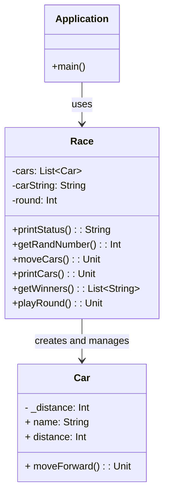
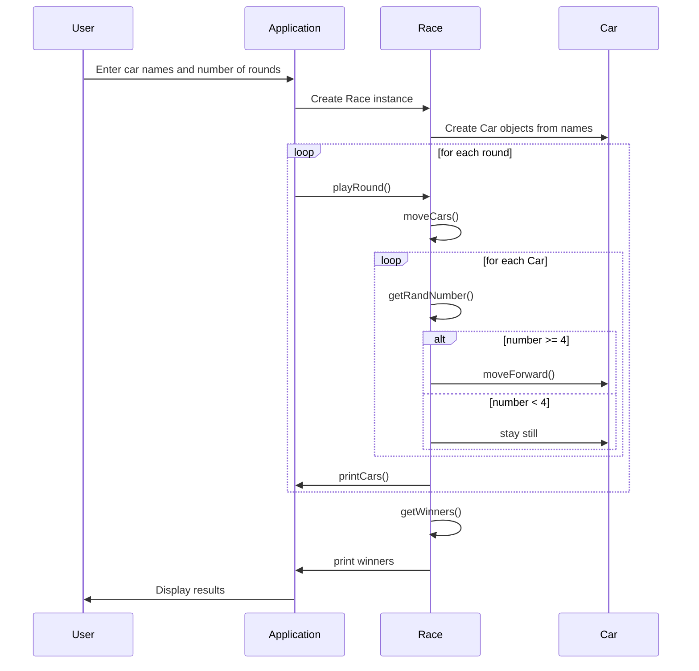

# kotlin-racingcar-precourse
---
## Example
### Input Example
- Names of the cars(comma-separated)
```pobi,woni,jun```
- Number of rounds
```5```
---
### Output Example
- Race results by round
```
pobi : --
woni : ----
jun : ---
```

- Message for a single winner
```Winners : pobi```

- Message for multiple winners
```Winners : pobi, jun```
---
### Example Execution
```
Enter the names of the cars (comma-separated):
pobi,woni,jun
How many rounds will be played?
5

Race Results
pobi : -
woni : 
jun : -

pobi : --
woni : -
jun : --

pobi : ---
woni : --
jun : ---

pobi : ----
woni : ---
jun : ----

pobi : -----
woni : ----
jun : -----

Winners : pobi, jun
```

---
## Functions


### Get Inputs
- Specify Car Name
  - should be comma-separated when entered by the user
  - each car must have a name(cannot exeed 5 characters)
- Specify Number of Rounds
- If the user inputs invalid data, the program should throw an `IllegalArtgumentException` and terminate


### Initialize Cars
- Split Input Strings by ','
- Creates Car instances for each name


### Race Progression
- Each of n cars can either **move forward** or **stay still** during a given number of rounds
- A car moves forward if a randomly generated number between 0~9 is 4 or greater.
1. Generate Radom Number
2. Move Forward depending on the random number result
   - If the number is 4 or more, the car moves forward by 1 unit.
3. Printing the Progress of Each Car(During the race)
  - display the car's name alongside its movement


### Display the Winners(After the race)
- There can be multiple winners if they reach the same final position
  - if there are multiple winners, their names should be displayed and separated by commas
- Find cars that reached the maximum distance
- Prints all winners' names separated by commas

---
## Class Diagram

---
## Sequence Diagram

