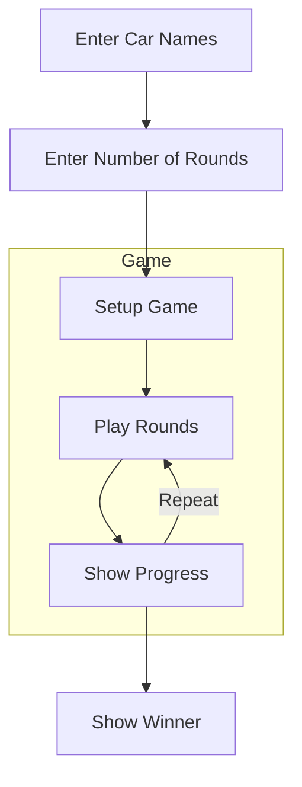
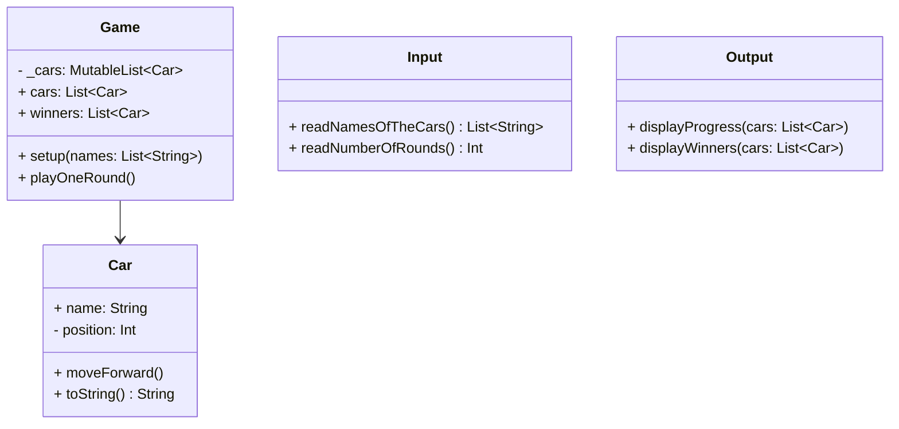
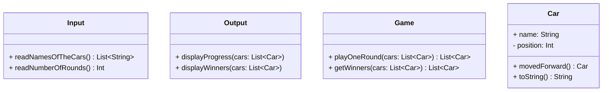

# 🚗 Car Racing

## 📝 Overview

This is a console-based car racing game built in Kotlin.
- Players input car names and the number of rounds to race.
- Each car moves forward if a randomly generated number is 4 or higher.
- The game prints progress after each round and announces the winner(s) at the end.

<image width="400" src="https://github.com/user-attachments/assets/727a8d53-2600-4ef0-ba11-b05f494bcbed">


## ✅ Feature Checklist

### Input
- [x] Read comma-separated car names from `Console.readLine()`
- [x] Read number of rounds from `Console.readLine()`
- [x] Validate input (e.g., empty names, name length, invalid number)
- [x] Throw `IllegalArgumentException` on invalid input

### Game
- [x] Implement movement rule (move forward if random number >= 4)
- [x] Simulate all rounds and update car positions
- [x] Determine winner(s) based on max position

### Output
- [x] Print car progress after each round (e.g., `pobi : --`)
- [x] Print winners in the required format (e.g., `Winners : pobi, jun`)

### Car
- [x] Represent each car with a name and position
- [x] Provide method to move forward
- [x] Provide string output for progress

### Testing
- [x] Write tests for all methods
- [x] Cover edge cases and exception scenarios

### Project
- [x] Follow the AngularJS Git Commit Message Conventions
- [x] Follow the Kotlin Coding Conventions
- [x] Keep indentation depth <= 2
- [x] Keep functions small and focused
- [x] Ensure each function does only one thing

## 📐 Requirement Analysis & Design

### 📓 Notes I wrote while reviewing the mission details

<image width="600" src="https://github.com/user-attachments/assets/b0bec2d4-1d2b-4188-8009-e1fb39b82e1a">

- The main keywords I took away are **Smaller Functions** and **Testing**.

- I decided to divide responsibilities into three main features:

|Feature|Description|
|--|--|
|**Input**|Read car names and number of rounds from `Console.readLine()` and validate the input. Throw `IllegalArgumentException` if the input is invalid.|
|**Game**|Move cars based on the game rules using `Randoms.pickNumberInRange()` to generate random numbers.|
|**Output**|Display the progress of each car and the final winners.|

> [!NOTE]  
> I chose to follow Test-Driven Development (TDD) because testing was strongly emphasized. I’m also focusing on keeping functions as small and focused as possible.

### 📊 Class Diagram & Flowchart

- Before starting the project, I wanted to design the overall flow and class structure of the program.

#### Flowchart



#### Class Diagram

- At first, I thought it made sense for both Car and Game to have their own state, so I designed them as normal classes.



- Later I realized that `Car` just holds simple values like `name` and `position`, and `Game` only updates `List<Car>`. So I decided to use an **immutable design** without storing state.
- But I did worry about flexibility. For example, if the game later supports different modes or special cars with boosters, it might be harder to extend.
- But instead, I decided to focus on **testability**, **separating each function clearly**, and **satisfying the requirements as given**.



## 🔧 Implementation Details

- Before testing, I thought about how to test input and output because they use `Console.readLine()`. I found `NsTest` can check the output and give input, but it was hard to control them one by one. So I made a simple `IOTest` class to help with that.

```java
public abstract class IOTest {
    protected final <T> T run(String input, Supplier<T> supplier) { ... }

    protected final <T> void runException(String input, Supplier<T> supplier) { ... }

    protected final String run(Runnable runnable) { ... }
}
```

### ✅ TDD

- I followed the TDD process as planned: writing tests first and then implementing each object or class.
- I repeated this for `Input`, `Game`, `Output`, `Car`, and `Application`.

```
* e60da36 feat(racingcar): implement Game object
* 69abc6a test(racingcar): add test for Game
```

### ♻️ Refactoring

- Extracted `isMovable()` from `playOneRound` to separate movement decision.

```kotlin
    // Before
    fun playOneRound(cars: List<Car>): List<Car> {
        val moveThreshold = 4
        val minRandom = 0
        val maxRandom = 9

        return cars.map {
            val randomNumber = Randoms.pickNumberInRange(minRandom, maxRandom)
            if (randomNumber >= moveThreshold) it.movedForward() else it
        }
    }
    
    // After
    fun playOneRound(cars: List<Car>): List<Car> = cars.map { if (isMovable()) it.movedForward() else it }
```

- I tried to make smaller functions that each do one thing well.
- I realized that the `main()` function was doing too much at once.

```kotlin
fun main() {
    // 📥 Step 1: Read user input
    Output.printCarNameInputMessage()
    val carNames = Input.readNamesOfTheCars()

    Output.printRoundInputMessage()
    val round = Input.readNumberOfRounds()

    // 🚗 Step 2: Initialize cars
    var cars = carNames.map { Car(it) }

    // 🏁 Step 3: Run game rounds
    Output.printRaceStartMessage()
    repeat(round) {
        cars = Game.playOneRound(cars)
        Output.printProgress(cars)
    }

    // 🏆 Step 4: Determine and print winners
    val winners = Game.winnersFrom(cars)
    Output.printWinners(winners)
}
```

- I split responsibilities between input handling and game flow:

1. `Input`: Handles user prompts and reads input values.
2. `Game`: Runs the game loop and displays progress and final results.

```kotlin
fun main() {
    val settings = Input.readSettings()
    Game.play(settings)
}
```

- also update file directory structure:

```
src/main/kotlin
└── racingcar
    ├── Application.kt          // Entry point
    ├── console                 // Input/output handling
    │   ├── Input.kt
    │   └── Output.kt
    ├── domain                  // Game logic
    │   └── Game.kt
    └── model                   // Data model
        ├── Car.kt
        └── Settings.kt
```
