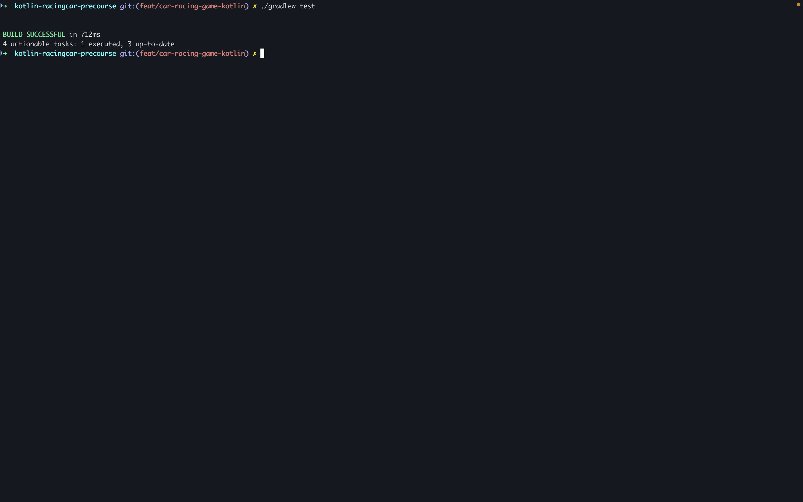
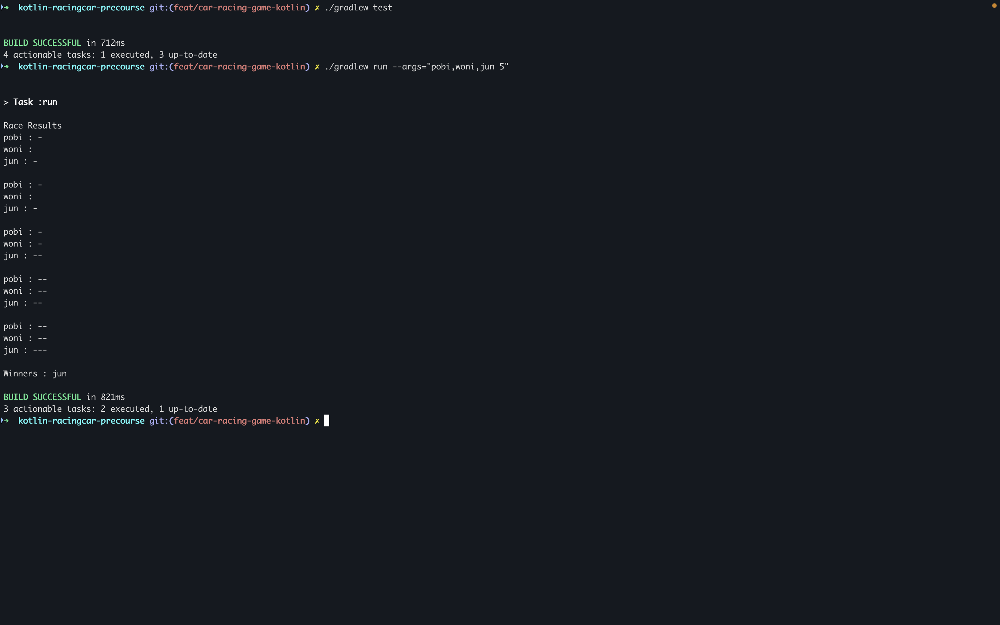

# Car Racing Game
This is a simple car racing game implemented in Kotlin where multiple cars race against each other for a specified number of rounds.

### Features to Implement
1. Input Validation
- Validate car names (comma-separated, max 5 characters per name)
- Validate number of rounds (must be a positive integer)

2. Car Movement Logic

- Implement random number generation for car movement
- Move car forward when random number ≥ 4
- Keep car stationary when random number < 4

3. Race Execution
- Create cars based on user input
- Execute specified number of rounds
- Track each car's position

4. Result Display
- Show race results after each round
- Determine and display winner(s) at the end of the race

5. Exception Handling
- Handle invalid inputs with appropriate exceptions

#### How to Run
- Clone the repository
- Run the Application.kt file
- Follow the prompts to enter car names and number of rounds

#### Libraries Used
- camp.nextstep.edu.missionutils.Randoms for random number generation
- camp.nextstep.edu.missionutils.Console for user input

