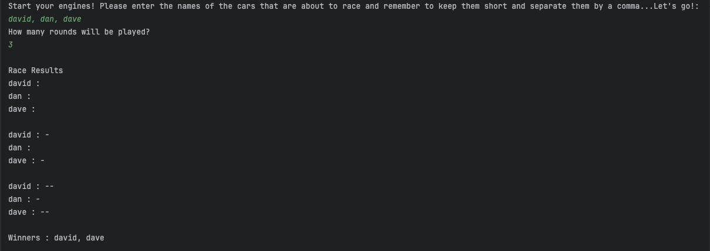
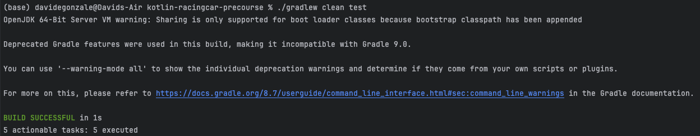

# kotlin-racingcar-precourse

This project is part of the **Hero Tech Pre-course**, an initiative by Delivery Hero. This repo was created with the purpose of solving Task 1, which is to implement a car racing game in **Kotlin**, focusing on clean code practices, test driven development, and functional correctness.

## Table of Contents
1. [Task Description](#task-description)
2. [Feature List](#feature-list)
3. [How to Run](#how-to-run)
4. [Project Structure](#project-structure)
5. [Testing](#testing)
6. [Reflection](#reflection)

## Task Description

The goal is to build a car racing game that: 

- Accepts a list of car names (max 5 characters each) and number of race rounds as input.
- Simulates each round, moving cars forward based on a random number generator.
- Displays the race progress after each round.
- Announces the winner(s) at the end (multiple winners are possible in case of a tie).
- Follows Kotlin coding conventions, uses the provided `Randoms` and `Console` APIs, and includes unit testing with JUnit 5 and AssertJ.

## Feature list

The following features are implemented in the car racing game according to Task 1 requirements. 

### Input Handling and Validation
- Prompt user to input car names (they have to be comma separated).
- Validate car names 
  - Car names are not empty.
  - Each car name is no longer than 5 characters.
- Prompt user to input number of race rounds.
- Validate round input (the number must be a positive integer).
- Throw `ÌllegalArgumentException` if the input is invalid.

### Game Logic
- Start game with racing cars, their names and positions.
- For each round:
    - Generate a random number (0–9) for each car.
    - Move the car forward if the number is 4 or higher.
- Track and update car positions round by round.

### Output and Results
- Display progress for each car after every round (`carName : ---`).
- Determine final winner(s) based on maximum distance.
- Display winner(s) in correct format:
    - `Winners : david`.
    - or `Winners : david, shin`.

### Testing and Quality
- All business logic is tested using JUnit 5 and AssertJ.
  - Unit tests for:
    - Input validation.
    - Game logic.
    - Check winner(s). 
- Follow Kotlin coding conventions (2-level indentation max).
- Use of `Randoms` and `Console` from `camp.nextstep.edu.missionutils`.

## How to Run

### 1. Via IntelliJ IDEA
1. Open the project in IntelliJ IDEA.
2. Locate the `Application.kt` file (inside `src/main/kotlin/racingcar/`).
3. Right-click on the `main` function and select **Run 'ApplicationKt'**.

The program will prompt you to enter:

* Car names (comma-separated).
* Number of race rounds.

The results will be displayed round by round as per specifications, followed by the winner.

Example:



## Project Structure
The project uses the default structure provided by the Hero Tech Pre-Course `kotlin-racingcar-precourse` repo and the requirements of not 
modifying the `build.gradle.kts` file and not using external libraries. 

## Testing

The project uses JUnit 5 and AssertJ for all unit and functional testing.

### What is tested:

- **ApplicationTest.kt**
  - Provided by Hero Tech and Woowa Tech
  - Extended with additional test cases:
    - Empty car name throws `IllegalArgumentException`
    - Invalid round input (non-numeric) throws `IllegalArgumentException`

- **CarTest.kt**
  - Custom unit tests for `Car` class:
    - Movement logic (`move(true)` and `move(false)`)
    - Output rendering (`render()`)

You can run tests via:

### 1. IntelliJ IDEA
1. Open the project in IntelliJ IDEA.
2. Locate the `ApplicationTest.kt` and `CarTest.kt`file (inside `src/test/kotlin/racingcar/`).
3. Right-click on the `ApplicationTest` class and select **Run 'ApplicationTest'**, repeat for CarTest.

### 2. Terminal

```bash
./gradlew clean test
```
Expected output:



## Reflection

This project was my first time building an app in Kotlin outside a learning environment such as the Kotlin Developer study plan in `Hyperskill`. I work with data, so I have some experience with Python,
that means working with kotlin was a bit different for me, I went around requirements and logic in my head for more than a few times to try to understand and implement it in Kotlin. 
Personally, it was a great opportunity to apply object-oriented principles in a different programming language, testing practices, and input validation in a small but complete application. 

### My takeaways: 

- Learned more about how to write idiomatic Kotlin and apply Kotlin specific conventions. 
- I used Kdoc to document code and make it more readable. 
- I practiced working with random behavior and functional testing.
- I followed `AngularJS Git Commit Message Conventions` best practices for commit messages.
- Most importantly, I got hands-on experience with translating problem requirements to working Kotlin code.