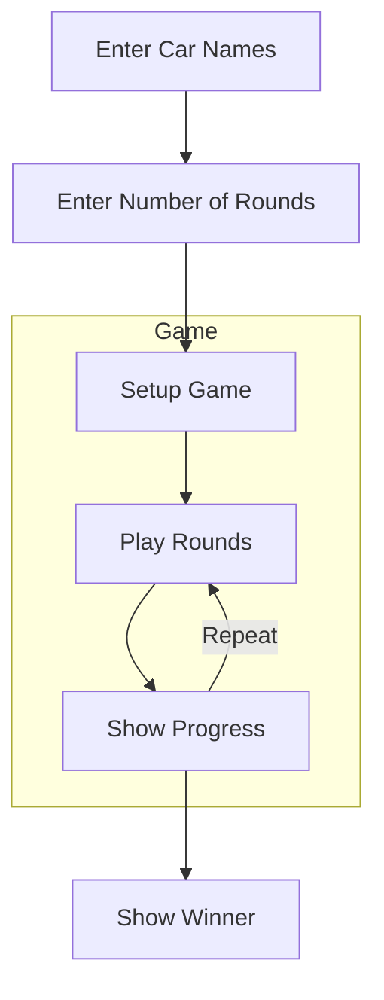
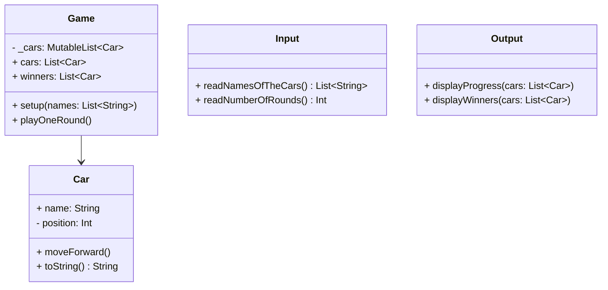
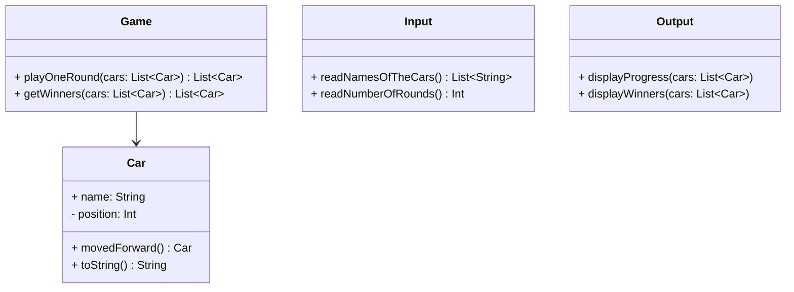

# 🚗 Car Racing

## 📝 Overview

## ✅ Feature Checklist

### Input
- [ ] Read comma-separated car names from `Console.readLine()`
- [ ] Read number of rounds from `Console.readLine()`
- [ ] Validate input (e.g., empty names, name length, invalid number)
- [ ] Throw `IllegalArgumentException` on invalid input

### Game
- [ ] Implement movement rule (move forward if random number >= 4)
- [ ] Simulate all rounds and update car positions
- [ ] Determine winner(s) based on max position

### Output
- [ ] Print car progress after each round (e.g., `pobi : --`)
- [ ] Print winners in the required format (e.g., `Winners : pobi, jun`)

### Car
- [ ] Represent each car with a name and position
- [ ] Provide method to move forward
- [ ] Provide string output for progress

### Testing
- [ ] Write tests for all methods
- [ ] Cover edge cases and exception scenarios

### Project
- [ ] Follow the AngularJS Git Commit Message Conventions
- [ ] Follow the Kotlin Coding Conventions
- [ ] Keep indentation depth <= 2
- [ ] Keep functions small and focused
- [ ] Ensure each function does only one thing

## 📐 Requirement Analysis & Design

### 📓 Notes I wrote while reviewing the mission details

<image width="600" src="https://github.com/user-attachments/assets/b0bec2d4-1d2b-4188-8009-e1fb39b82e1a">

- The main keywords I took away are **Smaller Functions** and **Testing**.

- I decided to divide responsibilities into three main features:

|Feature|Description|
|--|--|
|**Input**|Read car names and number of rounds from `Console.readLine()` and validate the input. Throw `IllegalArgumentException` if the input is invalid.|
|**Game**|Move cars based on the game rules using `Randoms.pickNumberInRange()` to generate random numbers.|
|**Output**|Display the progress of each car and the final winners.|

> [!NOTE]  
> I chose to follow Test-Driven Development (TDD) because testing was strongly emphasized. I’m also focusing on keeping functions as small and focused as possible.

### 📊 Class Diagram & Flowchart

- Before starting the project, I wanted to design the overall flow and class structure of the program.

#### Flowchart



#### Class Diagram

- At first, I thought it made sense for both Car and Game to have their own state, so I designed them as normal classes.



- Later I realized that `Car` just holds simple values like `name` and `position`, and `Game` only updates `List<Car>`. So I decided to use an **immutable design** without storing state.
- But I did worry about flexibility. For example, if the game later supports different modes or special cars with boosters, it might be harder to extend.
- But instead, I decided to focus on **testability**, **separating each function clearly**, and **satisfying the requirements as given**.



## 🔧 Implementation Details

- Before testing, I thought about how to test input and output because they use `Console.readLine()`. I found `NsTest` can check the output and give input, but it was hard to control them one by one. So I made a simple `IOTest` class to help with that.

```java
public abstract class IOTest {
    protected final <T> T run(String input, Supplier<T> supplier) { ... }

    protected final <T> void runException(String input, Supplier<T> supplier) { ... }

    protected final String run(Runnable runnable) { ... }
}
```