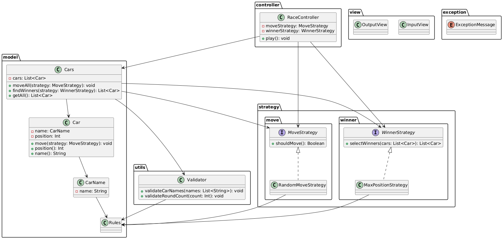

## 1. Folder structure
```bash
.
├── Application.kt
├── controller
│   └── RaceController.kt
├── exception
│   └── ExceptionMessage.kt
├── model
│   ├── Car.kt
│   ├── CarName.kt
│   ├── Cars.kt
│   └── Rules.kt
├── strategy
│   ├── move
│   │   ├── MoveStrategy.kt
│   │   └── RandomMoveStrategy.kt
│   └── winner
│       ├── WinnerStrategy.kt
│       └── MaxPositionStrategy.kt
├── utils
│   └── Validator.kt
└── view
    ├── InputView.kt
    └── OutputView.kt
```

# 2. Role of each Dir/Files
### Application.kt (Entry Point)
> - Call RaceController.play() to start game.

### controller/
> #### `RaceController.kt`
> - Control the entire game flow.

### view/
> #### `InputView.kt`
> - Handle user input. 
> #### `OutputView.kt`
> - Display race progress and winners.

### model/
> #### `Car.kt`
> - Represent a single car.
> - Hold position and provide movement logic via strategy.
> #### `CarName.kt`
> - Value object representing a car's name.
> - Enforces name-related domain invariants (not blank, max length)
> - Exists to guarantee domain-level correctness, even if input validation is bypassed.
> #### `Cars.kt`
> - Collection class managing multiple `Car` instances.
> - Apply strategies to move all cars and determine winners.
> - Delegate input validation to `Validator`.
> #### `Rules.kt`
> - Centralized constant values for game rules.

### strategy/
> #### `move/MoveStrategy.kt`
> - Interface defining car movement strategy.
> - Determine wheter a car should move in a round.
> #### `move/RandomMoveStrategy.kt`
> - Move car if generated number >= threshold(=4 in here.). It is default.
> #### `winner/WinnerStrategy.kt`
> - Interface defining how to select winners.
> #### `winner/MaxPositionStrategy.kt`
> - Select cars with highest position. It is default.

### utils/
> #### `Validator.kt`
> - Performs in input-level validation.
> - Called during model creation(`Cars`) to ensure valid input.

### exception/
> #### `ExceptionMessage.kt`
> - Ensure consistent error messaging across the app.

# 3. UML
> This image was generated using [PlantUML](https://www.planttext.com/) based on the contents of `docs/racingcar.puml`.



# 4. Additional Validation Logic
In addition to the required constraints described in the mission specification, the following validations were added to ensure better robustness and UX.
- Whitespace in car names is explicitly rejected.
> This decision was made to prevent unintended input from being silently accepted. For example, `"pobi"` and `" pobi"` would be treated as the same after trimming. But to the user, they might appear different. Therefore I decided to reject names with whitespace. This improves transparency, predictability, and reduces the risk of subtle bugs.
- Invalid characters are filtered via regex.
> Car names are restricted to alphanumeric characters only ([a-zA-Z0-9]).
- Upper limits are enforced.
> - Maximum car count is limited to 100.
> - Maximum round count is limited to 500.
> - These constraints prevent abuse, performance degradation, or infinite game loops.
- Duplicate car names are explicitly rejected.
> If two cars have same name, it is unclear which one each movement refers to in the printed result. To avoid this confusion, duplicated names are not allowed.
- Empty car names are explicitly rejected.
> Assume the input `"pobi,,woni"` is given. It will be parsed as ["pobi", "", "woni"]. Every car must have a name. If the input includes a blank or missing name between commas, it indicates an invalid car name.